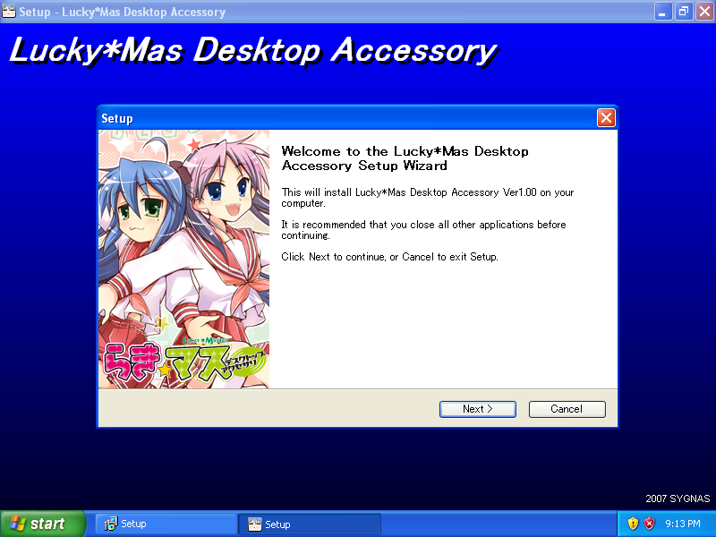
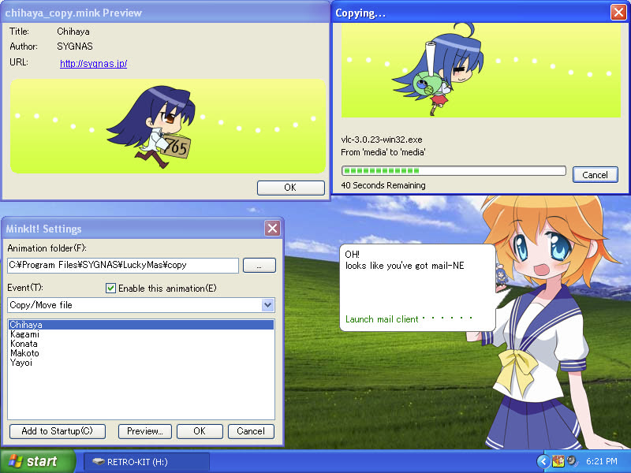
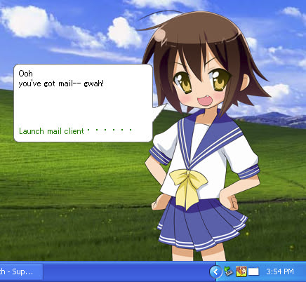
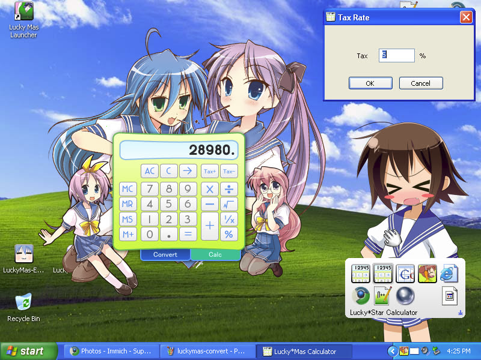
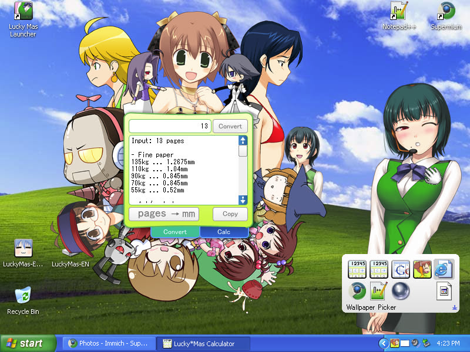
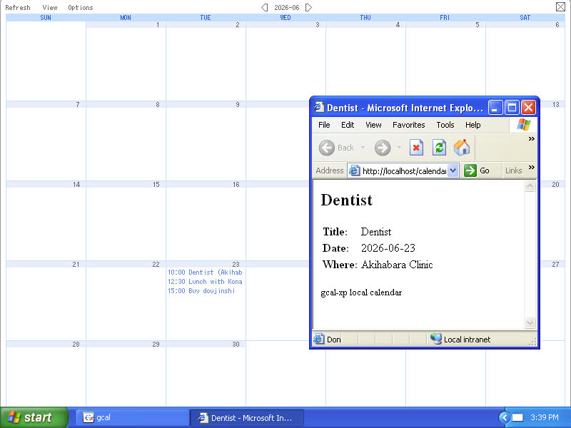
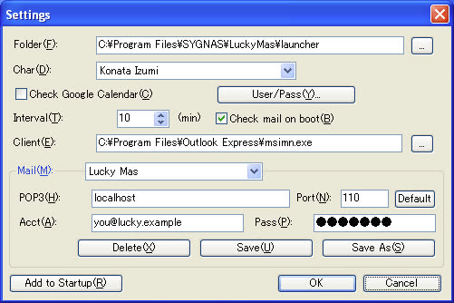

# LuckyMasterEN

**English fan-translation + a one-command patcher** for SYGNAS 「らき☆マス」(*Lucky☆Mas*) — a 2007
*Lucky☆Star × THE iDOLM@STER* **desktop-accessory pack** (circle **SYGNAS**, catalog SGNS-0009,
Comiket 73). Desktop mascots, a calendar companion that talks to you, themed calculators, and wallpapers
— fully in English, running on **real Windows XP**, with **no Google account** needed.

Plus a complete reverse-engineering log of SYGNAS's in-house **MinkIt** mascot engine and its container
formats. Give the tool your *own* copy of the disc; it builds you an English `setup.exe` / ISO. No
original SYGNAS file is ever redistributed.



**Everything below is running in English on real Windows XP SP3** — full writeup + more screenshots on the
**[project page ↗](https://lolisamurai.neocities.org/luckymas.html)**.

| | |
|:---:|:---:|
| <br>**Desktop mascots & copy animation** | <br>**"You've got mail"** |
| <br>**Themed calculators** | <br>**Unit conversions** |
| <br>**The month grid** | <br>**Launcher settings** |

---

### Get the original · support the work

- 💿 **The disc is out of print.** This patch applies to **your own copy** — find one second-hand (when
  it's in stock) on **[Suruga-ya](https://www.suruga-ya.jp/product/detail/186014567)**. The circle's
  site is long gone; there is no official store anymore.
- 🎨 **The original creator** (SYGNAS / ダダ) is now a professional web developer —
  **[x.com/sygnas](https://x.com/sygnas)**. There is no donation channel for the original work; if you
  can, buy the disc second-hand to support it.
- 💜 **Support this reverse-engineering & translation work:** **[ko-fi.com/lolisamurai](https://ko-fi.com/lolisamurai)**
  — it funds more RE/preservation projects like this one.

> 🤖 **The reverse-engineering in this project is entirely AI-driven.** The format cracking, the binary
> and resource patching, the native period-accurate TLS server, the themed-calculator re-texturing, and
> this whole cross-platform toolchain were all produced by an AI agent (Claude) working from the disc.

### 💜 For SYGNAS, the original authors

らき☆マス was a doujin labor of love: hand-drawn *Lucky☆Star × iM@S* characters living on your desktop, a
whole in-house animation engine (**MinkIt**) built just to make them move, a calendar mascot that actually
*talked* to you, themed calculators, screensavers, wallpapers — an entire little world, made by fans for
fans in 2007 with extraordinary care. Every character, every frame, and all of the original software is
**theirs**. This project exists only to keep that work alive on modern machines and let more people
discover it. Thank you for making something with so much soul.

---

## What's on the disc — and how to use it

Everything runs in English on Windows XP. Here's each piece and how to trigger it; the
reverse-engineering behind it all is documented at the **bottom of this README**.

| Feature | What it is | How to use it |
|---|---|---|
| 🧍 **Desktop mascots** ("Copy Animation") | Hand-drawn Konata / Kagami / Chihaya / Makoto / Yayoi (per-pixel-alpha, driven by the in-house **MinkIt** engine) that replace XP's file-copy animation. | Copy or move files in Explorer — a character plays the copy. Right-click its tray icon ▸ **Options** to choose the character or enable it per file operation. |
| 🗨️ **The launcher** | A desktop mascot (22 characters) with English speech bubbles. | **Click on her chest** to open the app launcher — yes, really; it's a classic anime gag — the **left side** opens the main menu (calculators, calendar, copy-animation, wallpaper, Display Properties), the **right side** opens a second menu (empty by default, for your own shortcuts). **Right-click her** for Calendar check / Mail check / Settings. **Add or change menu entries** in `launcher\Launch.ini`: under `[Launch]`, `Exec000…`/`Title000…` is the left menu and `Exec100…`/`Title100…` the right; `[Data] Chara=konata.Xvi` swaps the mascot. |
| 📅 **The talking calendar** | A mascot that speaks today's plans — originally Google Calendar, revived by a **bundled local server** (no Google account, no internet). | Runs at startup, or right-click the mascot ▸ **calendar check** → she reads the day's events. **Google Calendar** in the menu opens the full month grid. Put your own events in `gcal-xp\gcalsrv.lua` (the `EVENTS` table — it hot-reloads on save). |
| 📬 **Mail check** | A "you've got mail" bubble backed by a working local **POP3** mailbox. | Runs at startup, or right-click the mascot ▸ **mail check**; the bubble opens your mail client (Outlook Express by default). Edit your inbox in `gcalsrv.lua` (the `MAIL` table). |
| 🧮 **Themed calculators** | iM@S- and Lucky☆Star-skinned calculators plus a doujin unit **converter**. | Launch **iM@S Calculator** or **Lucky Star Calculator** from the launcher menu. The converter does BPM↔ms, ms↔fps frames, page-count↔paper thickness, and tax. |
| 🖼️ **Wallpapers** | 84 wallpapers (14 artists × resolutions) with an HTML **picker**. | Launch **Wallpaper** from the menu, then click a thumbnail in the gallery to set it. |
| 🌙 **Screensavers** | Four (iM@S 3D · iM@S Comic · Lucky☆Star Comic · Chibi). | ⚠️ **Broken on the disc — a known SYGNAS defect, not anything our patch does.** They're *ScreenTime for Flash* screensavers, but the disc shipped only the engine `.scr` without the content package they need, so they error out. SYGNAS later released the **working** versions separately as an apology; folding those into the EN build is [in progress](docs/next-builds.md). Background: [the screensaver teardown](docs/screensaver-re.md). |
| 📦 **The installer** | SYGNAS's Inno Setup wizard, faithfully re-wrapped in English. | Run `setup.exe` — or build your own English disc from your copy (see below). |

### The calendar, with no Google account

Hiyori on real **Windows XP SP3**, reading her calendar from our **native XP-local fake-Google server**
([`tools/gcal-xp/`](tools/gcal-xp/README.md)) — a single ~300 KB Win32 EXE that answers as
`www.google.com` over the box's own 2007 **WinINet↔Schannel** TLS stack (Schannel ClientLogin + GData
feeds + a POP3 mailbox; request logic in embedded Lua). The events are served entirely **locally** and
the speech is our English translation — no Google account, no internet.

---

## Build your own English disc (one command)

You own the disc; this turns it into an **English** one. Give it your disc's `setup.exe` and your own
copy of MS PGothic — out comes `LuckyMas-EN.iso` (a drop-in English disc image) and a `LuckyMas-EN.zip`.
Nothing here redistributes a SYGNAS or Microsoft file. **Full guide: [docs/end-user-build.md](docs/end-user-build.md).**

📀 **Check you have the supported disc first:** **[docs/source-disc.md](docs/source-disc.md)** — the
disc/`setup.exe` + per-file checksums, versions and metadata the patch is built against (and a
preservation record for this out-of-print 2007 disc).

```sh
# Windows — unzip LuckyMasEN-builder-win.zip, then (runs Inno Setup natively, no wine):
build.bat --setup D:\setup.exe --font auto

# Linux (Nix):
nix run github:Francesco149/LuckyMasEN#iso -- --setup ~/setup.exe --font auto

# anywhere with Python + innoextract (+ wine on Linux):
python tools/make_iso.py --setup ~/setup.exe --font auto
```

One engine ([`tools/make_iso.py`](tools/make_iso.py)) drives it everywhere: `innoextract` reads the app
tree straight out of your `setup.exe`, [`build_patch.py`](tools/build_patch.py) applies the English delta,
the faithful wizard art is pulled from your `setup.exe`, the Inno Setup compiler recompiles the installer,
and the disc image is written with pycdlib/xorriso. The freeware build tools are auto-downloaded pinned +
SHA-256-verified (the Windows bundle pre-seeds them, so it builds offline). Pre-built Windows + Linux
bundles are attached to the **[nightly release](../../releases/tag/nightly)**.

The faithful 586×364 wizard size is MS PGothic's specific metrics; no Latin font reproduces it, so the
toolchain bundles a **builder-supplied** copy of the font ([`tools/get_font.py`](tools/get_font.py)),
`AddFontResource`-d for the wizard and installed for the app's speech-bubble serifs — so it renders
correctly even on an XP with no East-Asian language pack.

## How it works (for the curious / contributors)

| Doc | What |
|---|---|
| [`docs/patch-system.md`](docs/patch-system.md) | the reproducible patch pipeline — one manifest, one engine, every file accounted for |
| [`docs/mink-format.md`](docs/mink-format.md) | the reverse-engineered SYGNAS container formats — `MINK` · `ACZ` (.Xvi) · `PACKDATA` (.pak) |
| [`docs/re-notes.md`](docs/re-notes.md) | the full running RE log (binaries, codecs, the Google/TLS protocol, the translation passes) |
| [`docs/end-user-build.md`](docs/end-user-build.md) | the self-service build guide (Windows + Linux) |
| [`docs/source-disc.md`](docs/source-disc.md) | the source disc's identity, versions + per-file checksums (verify the supported version; preservation record) |
| [`tools/gcal-xp/`](tools/gcal-xp/README.md) | the native XP-local fake-Google calendar/mail server |

## Hard rule: no redistribution of original files

We ship **only a delta + a tool** that applies to the user's *own* copy of the disc — the
fan-translation / ROM-hack model. No SYGNAS file is ever committed or distributed. The owner's working
copy lives in `originals/` and is **gitignored**. (The self-signed `www.google.com`/`localhost` cert
fixture under `tools/*/certs` is **not** a SYGNAS file and not a secret — a throwaway local TLS fixture,
committed on purpose so the served cert matches what the server trusts, byte-for-byte.)

## Layout

| Path | What |
|---|---|
| `flake.nix` | the whole toolchain — `nix develop` (RE/TL shell) and `nix run .#iso` (the builder) |
| `tools/` | the patch engine (`build_patch.py`), the one-command builder (`make_iso.py`), the extractors, and the native server (`gcal-xp/`) |
| `patch/` | the patch sources + **`manifest.toml`** — the single source of truth for every file we patch |
| `installer/` | the English Inno Setup script + the Windows builder bundle (`installer/windows/`) |
| `docs/` | the RE log, the format specs, the patch-system + build guides |
| `originals/`, `out/` | **gitignored** — your own disc input, and the build output (both contain SYGNAS bytes) |

## License

The tooling, patch sources, and docs in this repository are the project's own work. All original
characters, art, and software are © SYGNAS and the respective rights holders; none of it is included
here. This is an unofficial fan project, not affiliated with or endorsed by SYGNAS.
